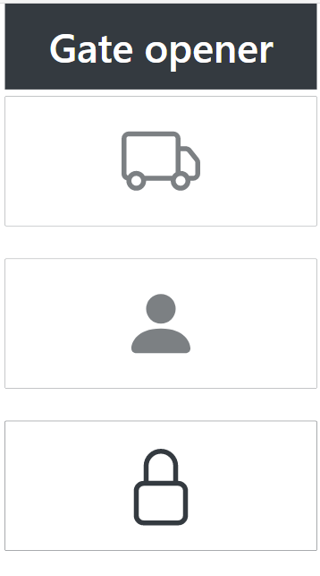
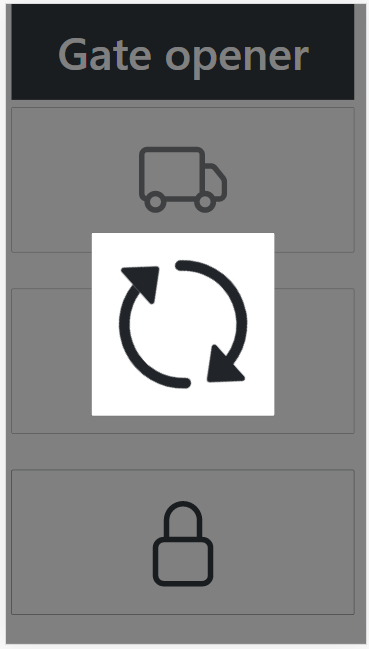
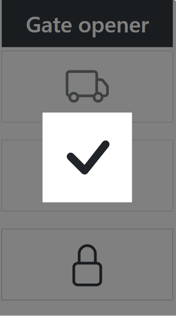
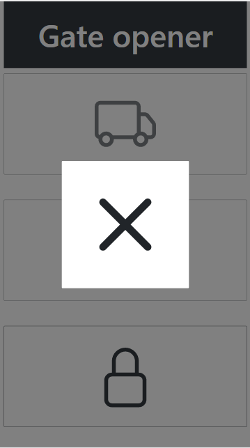

# RPI Gate Opener

RPI Gate Opener is a web application which can be used to open electric gates.
A Raspberry PI is attached to the gate controller with a relay board.
The single-board computer serves the web application with a Django backend which can trigger the gate via the GPOIs.
To ensure minimal latency and feedback for connectivity the commands are sent via WebSocket.

## Features
- Indicates if the application is successfuly connected
- User interface is automatically locked to prevent accidental activation
- Trigger vehicle access
- Trigger pedestrian access
- Gives feedback about the success of the trigger
- Sends email notifications about the trigger events

## License

All source code is licensed under the [MIT licence][mit].

[mit]: https://opensource.org/licenses/MIT